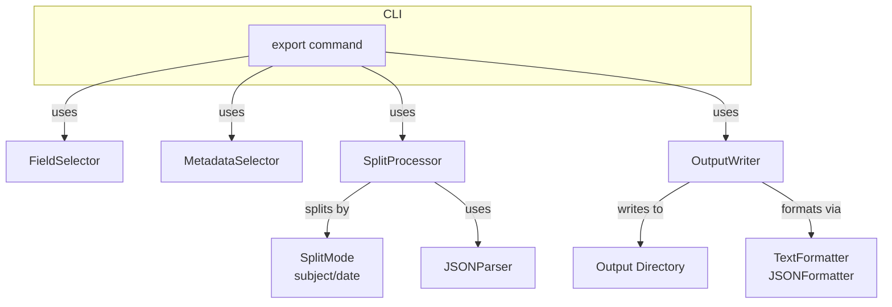
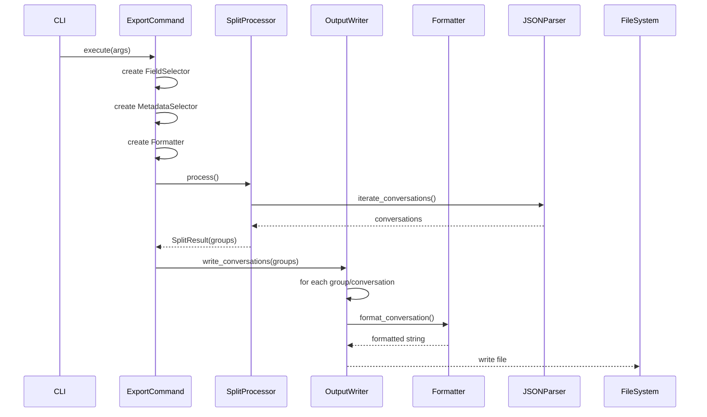

# Export/Split Architecture Design

## Overview

Design for a new export feature that processes JSON files and exports conversations with flexible splitting and output structure options.

## Requirements Summary

| Requirement | Decision |
|-------------|----------|
| Split by subject | Each conversation → its own file |
| Split by date | Daily folders (e.g., `output/2024-03-20/`) |
| Split by author | Not implemented |
| Default output | `./output` directory |
| File naming | Conversation title (sanitized) |
| Output format | Reuse existing formatters (txt, json) |

## Architecture



## Module Structure

```
chatgpt_export_tool/
├── commands/
│   └── export.py          # EXTEND: Add --split, --output-dir flags
├── core/
│   ├── parser.py          # Existing: JSONParser.iterate_conversations()
│   ├── formatters.py      # Existing: TextFormatter, JSONFormatter
│   ├── splitter.py        # NEW: SplitProcessor, SplitMode
│   └── output_writer.py  # NEW: OutputWriter, FileNamer
```

## New Modules

### 1. `core/splitter.py` - Split Strategy

```python
"""
Conversation splitting logic.

Provides SplitMode enum and SplitProcessor for dividing
conversations into groups based on various criteria.
"""

from dataclasses import dataclass
from enum import Enum
from typing import Any, Dict, Iterator, List

from chatgpt_export_tool.core.parser import JSONParser


class SplitMode(Enum):
    """Split mode for export operations."""
    
    SINGLE = "single"      # All to one file (backward compatible)
    SUBJECT = "subject"    # Each conversation → own file
    DATE = "date"          # Group by creation date (daily)


@dataclass
class SplitResult:
    """Result of splitting conversations.
    
    Attributes:
        mode: The split mode used.
        groups: Dictionary mapping group key to list of conversations.
        total_conversations: Total conversations processed.
        group_count: Number of groups created.
    """
    
    mode: SplitMode
    groups: Dict[str, List[Dict[str, Any]]]
    total_conversations: int = 0
    group_count: int = 0


class SplitProcessor:
    """Processes conversations and splits them according to mode.
    
    Example:
        >>> parser = JSONParser("data.json")
        >>> processor = SplitProcessor(parser, mode=SplitMode.DATE)
        >>> result = processor.process()
        >>> for date_folder, convs in result.groups.items():
        ...     print(f"{date_folder}: {len(convs)} conversations")
    """
    
    def __init__(self, parser: JSONParser, mode: SplitMode = SplitMode.SINGLE):
        """Initialize split processor.
        
        Args:
            parser: JSONParser instance for iterating conversations.
            mode: Split mode to use.
        """
        self.parser = parser
        self.mode = mode
    
    def process(self) -> SplitResult:
        """Process all conversations and split according to mode.
        
        Returns:
            SplitResult with grouped conversations.
        """
        groups: Dict[str, List[Dict[str, Any]]] = {}
        
        for conv in self.parser.iterate_conversations():
            key = self._get_group_key(conv)
            if key not in groups:
                groups[key] = []
            groups[key].append(conv)
        
        return SplitResult(
            mode=self.mode,
            groups=groups,
            total_conversations=len(conv for convs in groups.values() for conv in convs),
            group_count=len(groups),
        )
    
    def _get_group_key(self, conv: Dict[str, Any]) -> str:
        """Get the group key for a conversation based on split mode.
        
        Args:
            conv: Conversation dictionary.
            
        Returns:
            Group key string.
        """
        if self.mode == SplitMode.SINGLE:
            return "all"
        elif self.mode == SplitMode.SUBJECT:
            # Each conversation is its own group
            title = conv.get("title", "untitled")
            conv_id = conv.get("id", conv.get("_id", "unknown"))
            return f"{title}_{conv_id}"
        elif self.mode == SplitMode.DATE:
            # Group by creation date (daily)
            create_time = conv.get("create_time")
            if create_time:
                # Assuming timestamp, format as YYYY-MM-DD
                from datetime import datetime
                dt = datetime.fromtimestamp(float(create_time))
                return dt.strftime("%Y-%m-%d")
            return "unknown_date"
        return "all"
```

### 2. `core/output_writer.py` - Output Management

```python
"""
Output writing and file naming logic.

Handles writing formatted conversations to disk with
appropriate directory structure and file naming.
"""

import os
import re
from dataclasses import dataclass
from pathlib import Path
from typing import Any, Dict, List

from chatgpt_export_tool.core.formatters import BaseFormatter, get_formatter


class FileNamer:
    """Handles sanitization and generation of filenames from conversations."""
    
    # Characters to replace in filenames
    INVALID_CHARS = re.compile(r'[<>:"/\\|?*\x00-\x1f]')
    MAX_LENGTH = 200
    
    def __init__(self, max_length: int = MAX_LENGTH):
        """Initialize file namer.
        
        Args:
            max_length: Maximum filename length.
        """
        self.max_length = max_length
    
    def sanitize(self, title: str) -> str:
        """Sanitize conversation title for use as filename.
        
        Args:
            title: Original conversation title.
            
        Returns:
            Sanitized filename-safe string.
        """
        # Replace invalid characters with underscore
        sanitized = self.INVALID_CHARS.sub("_", title)
        # Collapse multiple underscores
        sanitized = re.sub(r"_+", "_", sanitized)
        # Strip leading/trailing underscores
        sanitized = sanitized.strip("_")
        # Truncate if too long
        if len(sanitized) > self.max_length:
            sanitized = sanitized[: self.max_length - 3] + "..."
        return sanitized or "untitled"
    
    def get_filename(self, conv: Dict[str, Any], extension: str = "txt") -> str:
        """Get filename for a conversation.
        
        Args:
            conv: Conversation dictionary.
            extension: File extension (without dot).
            
        Returns:
            Sanitized filename with extension.
        """
        title = conv.get("title", "untitled")
        return f"{self.sanitize(title)}.{extension}"


@dataclass
class WriteResult:
    """Result of a write operation.
    
    Attributes:
        files_written: Number of files written.
        directories_created: Number of directories created.
        total_bytes: Total bytes written.
        errors: List of error messages if any.
    """
    
    files_written: int = 0
    directories_created: int = 0
    total_bytes: int = 0
    errors: List[str] = None
    
    def __post_init__(self):
        if self.errors is None:
            self.errors = []


class OutputWriter:
    """Writes formatted conversations to disk.
    
    Manages directory structure and file naming based on
    split mode and output configuration.
    
    Example:
        >>> writer = OutputWriter(
        ...     output_dir="output",
        ...     format_type="txt",
        ...     split_mode=SplitMode.DATE,
        ... )
        >>> result = writer.write_conversations(groups, formatter)
    """
    
    def __init__(
        self,
        output_dir: str = "output",
        format_type: str = "txt",
        split_mode: Any = None,  # SplitMode enum
    ):
        """Initialize output writer.
        
        Args:
            output_dir: Base output directory.
            format_type: Output format (txt, json).
            split_mode: Split mode determining directory structure.
        """
        self.output_dir = Path(output_dir)
        self.format_type = format_type
        self.split_mode = split_mode
        self.file_namer = FileNamer()
    
    def write_conversations(
        self,
        groups: Dict[str, List[Dict[str, Any]]],
        formatter: BaseFormatter,
    ) -> WriteResult:
        """Write grouped conversations to disk.
        
        Args:
            groups: Dictionary mapping group keys to conversation lists.
            formatter: Formatter instance for formatting conversations.
            
        Returns:
            WriteResult with statistics.
        """
        result = WriteResult()
        
        for group_key, conversations in groups.items():
            for conv in conversations:
                try:
                    filepath = self._get_filepath(conv, group_key)
                    self._write_single(conv, filepath, formatter)
                    result.files_written += 1
                except Exception as e:
                    result.errors.append(f"Error writing {group_key}: {e}")
        
        return result
    
    def _get_filepath(self, conv: Dict[str, Any], group_key: str) -> Path:
        """Get the file path for a conversation.
        
        Args:
            conv: Conversation dictionary.
            group_key: Group key (for directory structure).
            
        Returns:
            Full file path.
        """
        # Determine directory based on split mode
        if self.split_mode and self.split_mode.value == "date":
            # Use date-based subdirectory
            dir_path = self.output_dir / group_key
        else:
            # Flat structure or single file
            dir_path = self.output_dir
        
        # Create directory if needed
        dir_path.mkdir(parents=True, exist_ok=True)
        
        # Get filename
        filename = self.file_namer.get_filename(conv, self.format_type)
        return dir_path / filename
    
    def _write_single(
        self, conv: Dict[str, Any], filepath: Path, formatter: BaseFormatter
    ) -> None:
        """Write a single conversation to disk.
        
        Args:
            conv: Conversation dictionary.
            filepath: Target file path.
            formatter: Formatter instance.
        """
        formatted = formatter.format_conversation(conv)
        content = formatted if isinstance(formatted, str) else formatted
        
        with open(filepath, "w", encoding="utf-8") as f:
            f.write(content)
```

## CLI Interface

### New Arguments for `export` Command

```
chatgpt-export export data.json [options]

New flags:
  --split MODE         Split mode: single, subject, date (default: single)
  --output-dir PATH    Output directory (default: ./output)
  
Existing flags preserved:
  --format, -F         Output format (txt, json)
  --fields, -f         Field selection
  --include            Metadata fields to include
  --exclude            Metadata fields to exclude
```

### Usage Examples

```bash
# Export all to single file (backward compatible)
chatgpt-export export data.json --output all_conversations.txt

# Split by subject (each conversation = own file)
chatgpt-export export data.json --split subject --output-dir ./exports

# Split by date (daily folders)
chatgpt-export export data.json --split date --output-dir ./exports
# Creates: ./exports/2024-03-20/conversation_title.txt

# Combined with existing filters
chatgpt-export export data.json --split subject --format json --output-dir ./exports
```

## Data Flow



## Implementation Steps

1. **Create `core/splitter.py`**
   - Define `SplitMode` enum
   - Implement `SplitResult` dataclass
   - Implement `SplitProcessor` class with `_get_group_key()` method

2. **Create `core/output_writer.py`**
   - Implement `FileNamer.sanitize()` for safe filenames
   - Implement `WriteResult` dataclass
   - Implement `OutputWriter` class with `write_conversations()`

3. **Update `commands/export.py`**
   - Add `--split` argument (choices: single, subject, date)
   - Add `--output-dir` argument (default: output)
   - Modify `ExportCommand._execute()` to use splitting and output writing

4. **Update `cli.py`**
   - Add new arguments to export parser

5. **Add tests**
   - Test `FileNamer.sanitize()` edge cases
   - Test `SplitProcessor` with different modes
   - Test `OutputWriter` directory creation

## Backward Compatibility

- Default `--split single` produces same output as current behavior
- `--output` still works for single file mode
- New `--output-dir` only applies to split modes

## File Sizes (Target)

| File | Target Lines | Purpose |
|------|--------------|---------|
| `splitter.py` | ~120 | Split logic |
| `output_writer.py` | ~150 | File writing |
| `export.py` | ~80 (modified) | CLI integration |
| **Total** | ~350 | |

## Open Questions

- [x] What does "split by subject" mean? → Each conversation = own file
- [x] What granularity for date splitting? → Daily folders
- [x] What does "split by author" mean? → Not implementing
- [x] What file naming pattern? → Just use title, sanitize special chars