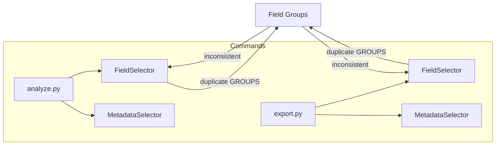

# Centralized Filtering and Validation Architecture

## Current State Analysis

### Issues Identified

| Issue | Location | Impact |
|-------|----------|--------|
| `FIELD_GROUPS` duplicated | `analyze.py:17`, `export.py:17` | DRY violation, maintenance burden |
| `FieldSelector.GROUPS` separate | `field_selector.py:24-36` | Inconsistent group definitions |
| No centralized validation | Scattered in commands/utils | Inconsistent error handling |
| Two filtering systems | `FieldSelector`, `MetadataSelector` | No unified API |
| No invalid field feedback | Silent ignore | Poor UX |
| No input sanitization | User patterns not validated | Security risk |

### Data Flow (Current)



## Proposed Architecture

### Module Structure

```
chatgpt_export_tool/core/
├── __init__.py              # Updated exports
├── category_fields.py       # CATEGORY_FIELDS, METADATA_FIELDS (unchanged)
├── field_groups.py          # NEW: FIELD_GROUPS single source of truth
├── field_selector.py        # REFACTORED: Use validators + field_groups
├── metadata_selector.py     # REFACTORED: Use validators
├── validators.py            # NEW: Centralized validation
├── filter_pipeline.py       # NEW: Unified filtering orchestration
└── field_config.py          # Updated re-exports
```

### 1. `core/field_groups.py` - Single Source of Truth

**Purpose**: Define FIELD_GROUPS once, import everywhere.

```python
"""
Field group definitions.

Single source of truth for field group names used across
FieldSelector and command-line interface.
"""

from typing import Dict, List

# Valid field group names for CLI --fields groups option
FIELD_GROUPS: List[str] = [
    "conversation",
    "message",
    "metadata",
    "minimal",
]

# Field group to actual field mappings
# Used by FieldSelector when mode="groups"
FIELD_GROUP_MAPPING: Dict[str, List[str]] = {
    "conversation": [
        "_id",
        "conversation_id",
        "create_time",
        "update_time",
        "title",
        "type",
    ],
    "message": ["author", "content", "status", "end_turn"],
    "metadata": ["model_slug", "message_type", "is_archived"],
    "minimal": ["title", "create_time", "message"],
}

__all__ = ["FIELD_GROUPS", "FIELD_GROUP_MAPPING"]
```

### 2. `core/validators.py` - Centralized Validation

**Purpose**: All validation in one place with consistent error handling.

```python
"""
Centralized validation for chatgpt_export_tool.

Provides validation functions and classes for field names,
patterns, modes, and user input sanitization.
"""

import fnmatch
import re
from dataclasses import dataclass, field
from typing import List, Optional, Set

from .category_fields import CATEGORY_FIELDS, METADATA_FIELDS
from .field_groups import FIELD_GROUPS, FIELD_GROUP_MAPPING


@dataclass
class ValidationResult:
    """Result of a validation operation.
    
    Attributes:
        is_valid: Whether validation passed.
        errors: List of error messages.
        warnings: List of warning messages.
        suggestions: List of helpful suggestions.
    """
    
    is_valid: bool = True
    errors: List[str] = field(default_factory=list)
    warnings: List[str] = field(default_factory=list)
    suggestions: List[str] = field(default_factory=list)
    
    def add_error(self, message: str) -> None:
        """Add an error message and mark as invalid."""
        self.errors.append(message)
        self.is_valid = False
    
    def add_warning(self, message: str) -> None:
        """Add a warning message."""
        self.warnings.append(message)
    
    def add_suggestion(self, message: str) -> None:
        """Add a helpful suggestion."""
        self.suggestions.append(message)


class FieldValidator:
    """Validates field-related user input.
    
    Provides methods to validate:
    - Field names against known categories
    - Field patterns (glob, partial, exact)
    - Field group names
    - Selection modes
    
    Attributes:
        available_fields: Set of known field names.
        known_categories: Set of known category names.
    """
    
    # Pattern for valid field names: alphanumeric, underscore, dash
    FIELD_NAME_PATTERN = re.compile(r"^[a-zA-Z_][a-zA-Z0-9_-]*$")
    
    def __init__(self) -> None:
        """Initialize validator with known fields."""
        self.available_fields = self._build_available_fields()
        self.known_categories = set(CATEGORY_FIELDS.keys())
    
    def _build_available_fields(self) -> Set[str]:
        """Build set of all available field names."""
        fields: Set[str] = set()
        for cat_fields in CATEGORY_FIELDS.values():
            fields.update(cat_fields)
        fields.update(METADATA_FIELDS.keys())
        return fields
    
    def validate_field_name(self, field_name: str) -> ValidationResult:
        """Validate a single field name.
        
        Args:
            field_name: Field name to validate.
            
        Returns:
            ValidationResult with any errors or warnings.
        """
        result = ValidationResult()
        
        # Check format
        if not self.FIELD_NAME_PATTERN.match(field_name):
            result.add_error(
                f"Invalid field name format: '{field_name}'. "
                f"Field names must start with letter/underscore and contain only "
                f"alphanumeric characters, underscores, or dashes."
            )
        
        # Check if known
        if field_name not in self.available_fields:
            result.add_warning(
                f"Unknown field: '{field_name}'. This field may be ignored."
            )
            # Suggest similar fields
            similar = self._find_similar_fields(field_name)
            if similar:
                result.add_suggestion(f"Did you mean: {', '.join(similar)}?")
        
        return result
    
    def validate_field_names(self, field_names: List[str]) -> ValidationResult:
        """Validate multiple field names.
        
        Args:
            field_names: List of field names to validate.
            
        Returns:
            Aggregated ValidationResult.
        """
        result = ValidationResult()
        
        for name in field_names:
            field_result = self.validate_field_name(name)
            result.errors.extend(field_result.errors)
            result.warnings.extend(field_result.warnings)
            result.suggestions.extend(field_result.suggestions)
        
        if result.errors:
            result.is_valid = False
        
        return result
    
    def validate_pattern(self, pattern: str) -> ValidationResult:
        """Validate a field pattern (glob, partial, exact).
        
        Args:
            pattern: Pattern to validate.
            
        Returns:
            ValidationResult with any errors or warnings.
        """
        result = ValidationResult()
        
        # Empty pattern
        if not pattern or not pattern.strip():
            result.add_error("Empty pattern provided")
            return result
        
        # Wildcard is always valid
        if pattern == "*":
            return result
        
        # Try to find matches
        matches = self._find_matching_fields(pattern)
        
        if not matches:
            result.add_warning(
                f"Pattern '{pattern}' matches no known fields"
            )
            result.add_suggestion(
                f"Available fields include: {', '.join(sorted(self.available_fields)[:10])}..."
            )
        
        return result
    
    def validate_group(self, group_name: str) -> ValidationResult:
        """Validate a field group name.
        
        Args:
            group_name: Group name to validate.
            
        Returns:
            ValidationResult with any errors or warnings.
        """
        result = ValidationResult()
        
        if group_name not in FIELD_GROUPS:
            result.add_error(
                f"Unknown field group: '{group_name}'. "
                f"Valid groups are: {', '.join(FIELD_GROUPS)}"
            )
        
        return result
    
    def validate_groups(self, group_names: List[str]) -> ValidationResult:
        """Validate multiple field group names.
        
        Args:
            group_names: List of group names to validate.
            
        Returns:
            Aggregated ValidationResult.
        """
        result = ValidationResult()
        
        for name in group_names:
            group_result = self.validate_group(name)
            result.errors.extend(group_result.errors)
            result.warnings.extend(group_result.warnings)
        
        if result.errors:
            result.is_valid = False
        
        return result
    
    def validate_mode(self, mode: str) -> ValidationResult:
        """Validate a selection mode.
        
        Args:
            mode: Mode to validate.
            
        Returns:
            ValidationResult with any errors or warnings.
        """
        result = ValidationResult()
        valid_modes = ["all", "none", "include", "exclude", "groups"]
        
        if mode not in valid_modes:
            result.add_error(
                f"Invalid mode: '{mode}'. Must be one of: {', '.join(valid_modes)}"
            )
        
        return result
    
    def validate_field_spec(self, spec: str) -> ValidationResult:
        """Validate a complete field specification string.
        
        Parses and validates specs like:
        - "all"
        - "include title,create_time"
        - "exclude model_slug"
        - "groups message,minimal"
        
        Args:
            spec: Field specification string.
            
        Returns:
            ValidationResult with any errors or warnings.
        """
        result = ValidationResult()
        
        if not spec or not spec.strip():
            result.add_error("Empty field specification")
            return result
        
        parts = spec.split()
        mode = parts[0]
        
        # Validate mode
        mode_result = self.validate_mode(mode)
        result.errors.extend(mode_result.errors)
        
        # Validate mode-specific arguments
        if mode in ("include", "exclude"):
            if len(parts) < 2:
                result.add_error(
                    f"Mode '{mode}' requires field names after mode"
                )
            else:
                fields = parts[1].split(",")
                field_result = self.validate_field_names(fields)
                result.errors.extend(field_result.errors)
                result.warnings.extend(field_result.warnings)
                result.suggestions.extend(field_result.suggestions)
        
        elif mode == "groups":
            if len(parts) < 2:
                result.add_error(
                    "Mode 'groups' requires group names after mode"
                )
            else:
                groups = parts[1].split(",")
                group_result = self.validate_groups(groups)
                result.errors.extend(group_result.errors)
                result.warnings.extend(group_result.warnings)
        
        elif mode not in valid_modes:
            # Backward compatibility: assume comma-separated field names
            fields = spec.split(",")
            field_result = self.validate_field_names(fields)
            result.errors.extend(field_result.errors)
            result.warnings.extend(field_result.warnings)
        
        if result.errors:
            result.is_valid = False
        
        return result
    
    def _find_similar_fields(self, field_name: str, max_results: int = 3) -> List[str]:
        """Find fields similar to the given field name."""
        from difflib import get_close_matches
        
        return get_close_matches(
            field_name, 
            list(self.available_fields), 
            n=max_results,
            cutoff=0.6
        )
    
    def _find_matching_fields(self, pattern: str) -> Set[str]:
        """Find all fields matching the given pattern."""
        matches: Set[str] = set()
        
        for field_name in self.available_fields:
            # Exact match
            if field_name == pattern:
                matches.add(field_name)
            # Partial match
            elif pattern in field_name:
                matches.add(field_name)
            # Glob match
            elif fnmatch.fnmatch(field_name, pattern):
                matches.add(field_name)
        
        return matches


# Module-level validator instance
_validator: Optional[FieldValidator] = None


def get_validator() -> FieldValidator:
    """Get the module-level FieldValidator instance.
    
    Returns:
        Singleton FieldValidator instance.
    """
    global _validator
    if _validator is None:
        _validator = FieldValidator()
    return _validator


def validate_field_spec(spec: str) -> ValidationResult:
    """Validate a field specification string.
    
    Convenience function that uses the module-level validator.
    
    Args:
        spec: Field specification string to validate.
        
    Returns:
        ValidationResult with any errors or warnings.
    """
    return get_validator().validate_field_spec(spec)


def validate_metadata_pattern(pattern: str) -> ValidationResult:
    """Validate a metadata field pattern.
    
    Args:
        pattern: Metadata pattern to validate.
        
    Returns:
        ValidationResult with any errors or warnings.
    """
    result = ValidationResult()
    
    if not pattern or not pattern.strip():
        result.add_error("Empty metadata pattern")
        return result
    
    if pattern == "*":
        return result
    
    # Check if matches any known metadata field
    if pattern not in METADATA_FIELDS:
        result.add_warning(
            f"Pattern '{pattern}' matches no known metadata fields"
        )
    
    return result


__all__ = [
    "ValidationResult",
    "FieldValidator",
    "get_validator",
    "validate_field_spec",
    "validate_metadata_pattern",
]
```

### 3. `core/filter_pipeline.py` - Unified Filtering Pipeline

**Purpose**: Orchestrate FieldSelector and MetadataSelector with a unified API.

```python
"""
Unified filtering pipeline for chatgpt_export_tool.

Provides FilterPipeline that orchestrates field selection and
metadata filtering with a single, consistent interface.
"""

import logging
from dataclasses import dataclass, field
from typing import Any, Dict, List, Optional, Set

from .field_groups import FIELD_GROUPS, FIELD_GROUP_MAPPING
from .field_selector import FieldSelector
from .metadata_selector import MetadataSelector
from .validators import ValidationResult, get_validator


logger = logging.getLogger(__name__)


@dataclass
class FilterConfig:
    """Configuration for filtering operations.
    
    Attributes:
        field_spec: Field specification string (e.g., "include title,create_time").
        include_metadata: Metadata fields to include.
        exclude_metadata: Metadata fields to exclude.
        validate: Whether to validate input (default True).
    """
    
    field_spec: str = "all"
    include_metadata: Optional[List[str]] = None
    exclude_metadata: Optional[List[str]] = None
    validate: bool = True


@dataclass
class FilterResult:
    """Result of a filtering operation.
    
    Attributes:
        validation: Validation result if validated.
        field_selector: The FieldSelector instance used.
        metadata_selector: The MetadataSelector instance used.
        applied_filters: Description of filters that were applied.
    """
    
    validation: Optional[ValidationResult] = None
    field_selector: Optional[FieldSelector] = None
    metadata_selector: Optional[MetadataSelector] = None
    applied_filters: List[str] = field(default_factory=list)
    
    @property
    def is_valid(self) -> bool:
        """Check if validation passed (if validation was performed)."""
        if self.validation is None:
            return True
        return self.validation.is_valid
    
    def get_warnings(self) -> List[str]:
        """Get any warnings from validation."""
        if self.validation is None:
            return []
        return self.validation.warnings


class FilterPipeline:
    """Unified filtering pipeline for conversations.
    
    Orchestrates FieldSelector and MetadataSelector to provide
    a single interface for filtering conversations.
    
    Example:
        pipeline = FilterPipeline.from_config(FilterConfig(
            field_spec="include title,create_time",
            exclude_metadata=["model_slug"]
        ))
        
        filtered = pipeline.filter(conversation)
    """
    
    def __init__(
        self,
        field_selector: FieldSelector,
        metadata_selector: Optional[MetadataSelector] = None,
        validation: Optional[ValidationResult] = None,
    ) -> None:
        """Initialize pipeline with selectors.
        
        Args:
            field_selector: Configured FieldSelector.
            metadata_selector: Optional MetadataSelector.
            validation: Optional validation result.
        """
        self.field_selector = field_selector
        self.metadata_selector = metadata_selector
        self.validation = validation
    
    @classmethod
    def from_config(
        cls, config: FilterConfig, raise_on_invalid: bool = False
    ) -> FilterResult:
        """Create pipeline from FilterConfig.
        
        Args:
            config: Filter configuration.
            raise_on_invalid: If True, raise ValueError on invalid config.
            
        Returns:
            FilterResult containing pipeline and validation result.
        """
        result = FilterResult()
        validator = get_validator()
        
        # Validate if requested
        if config.validate:
            logger.debug(f"Validating field spec: {config.field_spec}")
            validation = validator.validate_field_spec(config.field_spec)
            result.validation = validation
            
            if not validation.is_valid and raise_on_invalid:
                raise ValueError(
                    f"Invalid field spec: {config.field_spec}. "
                    f"Errors: {validation.errors}"
                )
            
            # Log warnings
            for warning in validation.warnings:
                logger.warning(warning)
        
        # Create field selector
        logger.debug(f"Creating FieldSelector with spec: {config.field_spec}")
        field_selector = FieldSelector.from_string(config.field_spec)
        result.field_selector = field_selector
        result.applied_filters.append(f"fields={config.field_spec}")
        
        # Create metadata selector if needed
        metadata_selector = None
        if config.include_metadata or config.exclude_metadata:
            logger.debug(
                f"Creating MetadataSelector: "
                f"include={config.include_metadata}, "
                f"exclude={config.exclude_metadata}"
            )
            metadata_selector = MetadataSelector.from_args(
                include=config.include_metadata,
                exclude=config.exclude_metadata,
            )
            result.metadata_selector = metadata_selector
            
            inc = config.include_metadata or []
            exc = config.exclude_metadata or []
            result.applied_filters.append(f"metadata: include={inc}, exclude={exc}")
        
        return FilterResult(
            validation=result.validation,
            field_selector=field_selector,
            metadata_selector=metadata_selector,
            applied_filters=result.applied_filters,
        )
    
    def filter(self, conversation: Dict[str, Any]) -> Dict[str, Any]:
        """Filter a conversation through the pipeline.
        
        Args:
            conversation: Conversation dictionary to filter.
            
        Returns:
            Filtered conversation dictionary.
        """
        logger.debug("Applying field selection")
        filtered = self.field_selector.filter_conversation(conversation)
        
        if self.metadata_selector:
            logger.debug("Applying metadata filtering")
            filtered = self.metadata_selector.filter_metadata(filtered)
        
        return filtered
    
    def filter_many(
        self, conversations: List[Dict[str, Any]]
    ) -> List[Dict[str, Any]]:
        """Filter multiple conversations through the pipeline.
        
        Args:
            conversations: List of conversation dictionaries.
            
        Returns:
            List of filtered conversation dictionaries.
        """
        logger.debug(f"Filtering {len(conversations)} conversations")
        return [self.filter(conv) for conv in conversations]


__all__ = [
    "FilterConfig",
    "FilterResult",
    "FilterPipeline",
]
```

### 4. Refactored `core/field_selector.py`

**Changes**:
- Remove duplicate `GROUPS` definition, import from `field_groups.py`
- Use validators for input validation
- Add validation to `from_string()` method
- Provide better error messages

```python
# Key changes to existing FieldSelector class:

from .field_groups import FIELD_GROUPS, FIELD_GROUP_MAPPING

class FieldSelector:
    # Remove duplicate GROUPS dict - now imported from field_groups.py
    
    # Add validation to from_string
    @classmethod
    def from_string(cls, field_spec: str, validate: bool = True) -> "FieldSelector":
        """Create FieldSelector from command-line string.
        
        Args:
            field_spec: String specification like "all", "include title,create_time".
            validate: Whether to validate the spec (default True).
            
        Returns:
            Configured FieldSelector instance.
            
        Raises:
            ValueError: If validate=True and spec is invalid.
        """
        if validate:
            validator = get_validator()
            result = validator.validate_field_spec(field_spec)
            if not result.is_valid:
                raise ValueError(f"Invalid field spec: {result.errors[0]}")
        
        # ... rest of method unchanged
    
    # Update get_selected_fields to use FIELD_GROUP_MAPPING
    def get_selected_fields(self, all_fields: Set[str]) -> Set[str]:
        # ... existing logic ...
        
        elif self.mode == "groups":
            selected = set()
            for group_name in self.groups:
                # Use FIELD_GROUP_MAPPING from field_groups.py
                if group_name in FIELD_GROUP_MAPPING:
                    selected.update(FIELD_GROUP_MAPPING[group_name])
                # Fallback to CATEGORY_FIELDS for category names
                elif group_name in CATEGORY_FIELDS:
                    selected.update(CATEGORY_FIELDS[group_name])
                # Unknown group silently ignored (for backward compat)
            return selected & all_fields
```

### 5. Refactored `core/metadata_selector.py`

**Changes**:
- Use validators for pattern validation
- Add `validate()` method that returns ValidationResult

```python
# Key changes to MetadataSelector:

from .validators import ValidationResult, validate_metadata_pattern

class MetadataSelector:
    def validate(self) -> ValidationResult:
        """Validate the current include/exclude patterns.
        
        Returns:
            ValidationResult with any errors or warnings.
        """
        result = ValidationResult()
        
        for pattern in self.include_fields:
            pattern_result = validate_metadata_pattern(pattern)
            result.errors.extend(pattern_result.errors)
            result.warnings.extend(pattern_result.warnings)
        
        for pattern in self.exclude_fields:
            pattern_result = validate_metadata_pattern(pattern)
            result.errors.extend(pattern_result.errors)
            result.warnings.extend(pattern_result.warnings)
        
        if result.errors:
            result.is_valid = False
        
        return result
```

### 6. Updated `core/field_config.py`

```python
"""
Field configuration and selection logic.

Provides flexible field filtering/selection for export operations.

This module re-exports from specialized modules for backward compatibility.
For direct imports, prefer:
    from chatgpt_export_tool.core.field_groups import FIELD_GROUPS
    from chatgpt_export_tool.core.validators import FieldValidator, validate_field_spec
    from chatgpt_export_tool.core.filter_pipeline import FilterPipeline, FilterConfig
    from chatgpt_export_tool.core.field_selector import FieldSelector
    from chatgpt_export_tool.core.metadata_selector import MetadataSelector
"""

# Re-export constants from field_groups for backward compatibility
from .field_groups import FIELD_GROUPS, FIELD_GROUP_MAPPING

# Re-export from category_fields for backward compatibility
from .category_fields import CATEGORY_FIELDS, METADATA_FIELDS

# Re-export selectors
from .field_selector import FieldSelector
from .metadata_selector import MetadataSelector

# Re-export validators and pipeline
from .validators import FieldValidator, ValidationResult, validate_field_spec
from .filter_pipeline import FilterPipeline, FilterConfig

__all__ = [
    # Field groups
    "FIELD_GROUPS",
    "FIELD_GROUP_MAPPING",
    # Category fields
    "CATEGORY_FIELDS",
    "METADATA_FIELDS",
    # Selectors
    "FieldSelector",
    "MetadataSelector",
    # Validators
    "FieldValidator",
    "ValidationResult",
    "validate_field_spec",
    # Pipeline
    "FilterPipeline",
    "FilterConfig",
]
```

## Usage Examples

### Before (Current State)

```python
# In export.py
from chatgpt_export_tool.core.field_config import FieldSelector, MetadataSelector

FIELD_GROUPS = ["conversation", "message", "metadata", "minimal"]  # DUPLICATED!

field_selector = FieldSelector.from_string(self.fields)
metadata_selector = MetadataSelector.from_args(
    include=self.include, exclude=self.exclude
)
```

### After (Proposed)

```python
# In export.py
from chatgpt_export_tool.core.field_config import FilterPipeline, FilterConfig

config = FilterConfig(
    field_spec=self.fields,
    include_metadata=self.include,
    exclude_metadata=self.exclude,
)
result = FilterPipeline.from_config(config)

# Or use direct selectors for more control
from chatgpt_export_tool.core.field_config import FieldSelector, MetadataSelector
from chatgpt_export_tool.core.field_groups import FIELD_GROUPS  # Single source

field_selector = FieldSelector.from_string(self.fields)
metadata_selector = MetadataSelector.from_args(
    include=self.include, exclude=self.exclude
)
```

### Validation Example

```python
# Validate user input before processing
from chatgpt_export_tool.core.validators import validate_field_spec

result = validate_field_spec("include title,unknown_field")
if not result.is_valid:
    print(f"Errors: {result.errors}")
    for warning in result.warnings:
        print(f"Warning: {warning}")
    for suggestion in result.suggestions:
        print(f"Suggestion: {suggestion}")
```

## Migration Path

### Phase 1: Add New Modules (Backward Compatible)
1. Create `core/field_groups.py` with `FIELD_GROUPS` and `FIELD_GROUP_MAPPING`
2. Create `core/validators.py` with validation functions
3. Create `core/filter_pipeline.py` with FilterPipeline
4. Update `core/__init__.py` to export new modules

### Phase 2: Refactor Existing Modules (Backward Compatible)
5. Update `core/field_selector.py` to import from `field_groups.py`
6. Update `core/metadata_selector.py` to add validation method
7. Update `core/field_config.py` to re-export new modules

### Phase 3: Update Commands (Use New Modules)
8. Update `commands/analyze.py` to import `FIELD_GROUPS` from core
9. Update `commands/export.py` to import `FIELD_GROUPS` from core
10. Optionally update commands to use FilterPipeline

### Phase 4: Add Tests and Cleanup
11. Add tests for validators module
12. Add tests for filter pipeline
13. Run full test suite
14. Update documentation

## Extensibility

### Adding New Field Groups

To add a new field group, only modify `core/field_groups.py`:

```python
FIELD_GROUPS.append("custom_group")
FIELD_GROUP_MAPPING["custom_group"] = ["field1", "field2", "field3"]
```

### Adding New Validation Rules

To add new validation rules, modify `core/validators.py`:

```python
def validate_field_name(self, field_name: str) -> ValidationResult:
    # Add new validation logic
```

### Adding New Filter Stages

To add a new filter stage, extend `FilterPipeline`:

```python
class ExtendedFilterPipeline(FilterPipeline):
    def filter(self, conversation):
        filtered = super().filter(conversation)
        # Add new filter stage
        return self.apply_custom_filter(filtered)
```

## File Sizes (Target)

| File | Target Lines |
|------|-------------|
| `field_groups.py` | ~40 |
| `validators.py` | ~250 |
| `filter_pipeline.py` | ~150 |
| `field_selector.py` | ~180 (refactored) |
| `metadata_selector.py` | ~210 (refactored) |
| `field_config.py` | ~50 |
| **Total** | ~880 |
